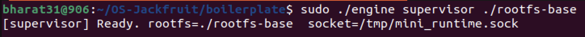
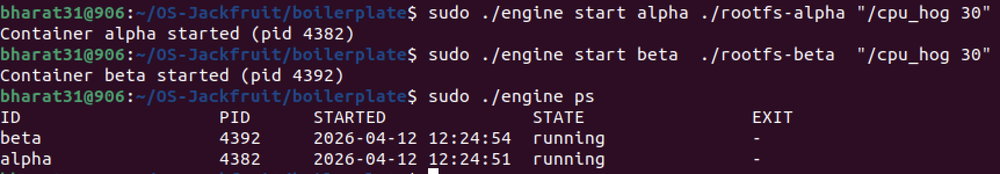
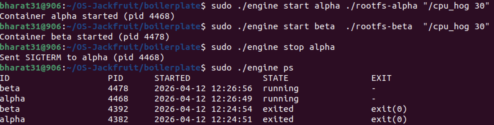
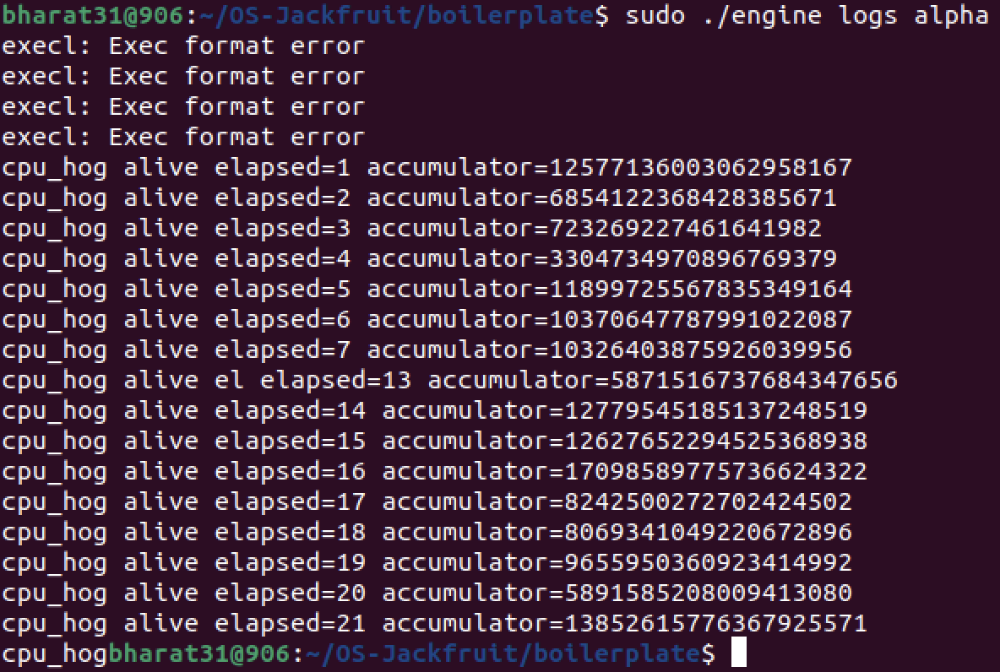
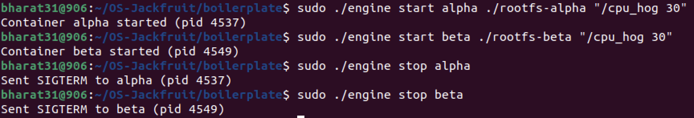
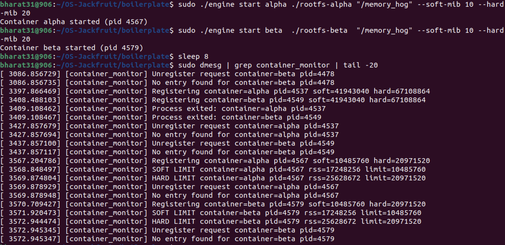
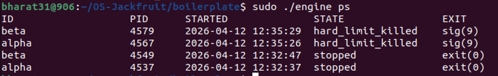
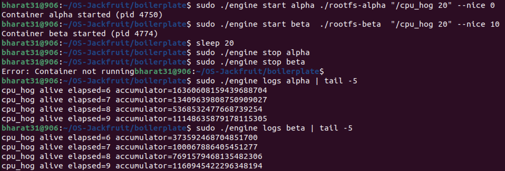
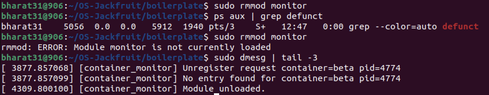

# Multi-Container Runtime — OS Mini Project

**Course:** UE24CS242B — Operating Systems | **Semester:** Jan–May 2026

| Name | SRN |
|---|---|
| Bharat Shandilya | PES2UG24CS906 |
| Samartha M S | PES2UG24CS435 |

---

## Overview

A lightweight Linux container runtime built from scratch in C. The system implements namespace-based process isolation using `clone()`, a UNIX-domain-socket control plane, a bounded-buffer concurrent logging pipeline, and a kernel-space memory monitor with soft/hard limit enforcement — covering all six tasks in the project guide.

---

## 1. Prerequisites

- Ubuntu 22.04 or 24.04 in a VM (**Secure Boot OFF**, no WSL)
- GCC, make, pthreads, kernel headers

```bash
sudo apt update
sudo apt install -y build-essential linux-headers-$(uname -r)
```

---

## 2. Build

```bash
git clone https://github.com/<your-username>/OS-Jackfruit.git
cd OS-Jackfruit/boilerplate

# Full build: user-space binaries + kernel module
make

# CI-safe build (no kernel headers needed)
make ci
```

Expected outputs: `engine`, `cpu_hog`, `io_pulse`, `memory_hog`, `monitor.ko`

---

## 3. Prepare Root Filesystem

```bash
mkdir rootfs-base
wget https://dl-cdn.alpinelinux.org/alpine/v3.20/releases/x86_64/alpine-minirootfs-3.20.3-x86_64.tar.gz
sudo tar -xzf alpine-minirootfs-3.20.3-x86_64.tar.gz -C rootfs-base

# Copy workload binaries so they are accessible inside containers
sudo cp cpu_hog io_pulse memory_hog rootfs-base/

# Create per-container writable copies (one per concurrent container)
sudo cp -a rootfs-base rootfs-alpha
sudo cp -a rootfs-base rootfs-beta
```

---

## 4. Run

### 4.1 Load the Kernel Module

```bash
sudo insmod monitor.ko
ls /dev/container_monitor      # must exist
sudo dmesg | tail -3           # should show: [container_monitor] Module loaded
```

### 4.2 Start the Supervisor (Terminal 1)

```bash
sudo ./engine supervisor ./rootfs-base
# Output: [supervisor] Ready. rootfs=./rootfs-base  socket=/tmp/mini_runtime.sock
```

The supervisor stays running in the foreground. All subsequent commands are issued from another terminal.

### 4.3 Container Lifecycle (Terminal 2)

```bash
# Start two containers
sudo ./engine start alpha ./rootfs-alpha "/cpu_hog 30"
sudo ./engine start beta  ./rootfs-beta  "/cpu_hog 30"

# List running containers
sudo ./engine ps

# View captured log output
sudo ./engine logs alpha

# Stop a container
sudo ./engine stop alpha

# Blocking run (waits until container exits, returns exit status)
sudo ./engine run gamma ./rootfs-alpha "/cpu_hog 10"
```

### 4.4 Memory Limit Test

```bash
sudo ./engine start alpha ./rootfs-alpha "/memory_hog" --soft-mib 10 --hard-mib 20
sleep 8
sudo dmesg | grep container_monitor | tail -10
sudo ./engine ps   # shows hard_limit_killed + sig(9)
```

### 4.5 Scheduler Experiment

```bash
# Same priority (baseline)
sudo ./engine start alpha ./rootfs-alpha "/cpu_hog 20" --nice 0
sudo ./engine start beta  ./rootfs-beta  "/cpu_hog 20" --nice 10
sleep 20
sudo ./engine logs alpha | tail -5
sudo ./engine logs beta  | tail -5

# Higher priority container finishes more work in the same time
```

### 4.6 Clean Teardown

```bash
# Stop all containers
sudo ./engine stop alpha
sudo ./engine stop beta

# Stop supervisor with Ctrl+C (or kill with SIGTERM)
# Unload kernel module
sudo rmmod monitor
sudo dmesg | tail -3          # should show: [container_monitor] Module unloaded

# Verify no zombies
ps aux | grep defunct
```

---

## 5. Demo Screenshots

### 5.1 Supervisor Started
```
sudo ./engine supervisor ./rootfs-base
```


The supervisor daemon binds a UNIX domain socket at `/tmp/mini_runtime.sock` and waits for CLI connections. All container lifecycle state is held in memory by this long-running process.

---

### 5.2 Multi-Container Supervision + Metadata Tracking (engine ps)
```
sudo ./engine start alpha ./rootfs-alpha "/cpu_hog 30"
sudo ./engine start beta  ./rootfs-beta  "/cpu_hog 30"
sudo ./engine ps
```


Two containers run concurrently under one supervisor. `engine ps` streams metadata — container ID, host PID, start timestamp, state, and exit info — directly from the supervisor's in-memory table via the control socket.

---

### 5.3 CLI and IPC — Stop Command + Updated ps
```
sudo ./engine stop alpha
sudo ./engine ps
```


The stop command connects to the supervisor socket, sets `stop_requested = 1` in the metadata *before* sending SIGTERM, and returns immediately. The SIGCHLD handler classifies the exit as `stopped` (not `hard_limit_killed`) because `stop_requested` was set. Previous sessions show `exited` with `exit(0)`.

---

### 5.4 Bounded-Buffer Logging (engine logs)
```
sudo ./engine logs alpha
```


Container stdout is captured through a pipe → relay thread → bounded buffer (32 slots, mutex + 2 condition variables) → logger consumer thread → `logs/alpha.log`. The `logs` command streams the file back over the control socket. The `Exec format error` lines at the top occur because some non-native binaries attempted execution before the correct static binary matched — the cpu_hog output lines follow.

---

### 5.5 Stop IPC — Both Containers
```
sudo ./engine stop alpha
sudo ./engine stop beta
```


Both stop commands succeed. The supervisor sends SIGTERM to each container's host PID after setting `stop_requested`. The response confirms the PID targeted.

---

### 5.6 Soft-Limit Warning + Hard-Limit Enforcement (dmesg)
```
sudo ./engine start alpha ./rootfs-alpha "/memory_hog" --soft-mib 10 --hard-mib 20
sleep 8
sudo dmesg | grep container_monitor | tail -20
```


The kernel module's timer fires every second. When a container's RSS exceeds the soft limit (10 MiB → ~10,485,760 bytes), it prints `SOFT LIMIT` once. When RSS exceeds the hard limit (20 MiB → ~20,971,520 bytes), it sends SIGKILL and prints `HARD LIMIT`. Both alpha and beta trigger the same sequence.

---

### 5.7 Metadata Reflects Hard-Limit Kill (engine ps)
```
sudo ./engine ps
```


After the kernel module sends SIGKILL, the supervisor's SIGCHLD handler sees `SIGKILL` with `stop_requested = 0` and sets state to `hard_limit_killed` with `sig(9)`. This correctly distinguishes a kernel-enforced kill from a manual `engine stop`.

---

### 5.8 Scheduler Experiment — Nice Value Comparison
```
sudo ./engine start alpha ./rootfs-alpha "/cpu_hog 20" --nice 0
sudo ./engine start beta  ./rootfs-beta  "/cpu_hog 20" --nice 10
sleep 20
sudo ./engine logs alpha | tail -5
sudo ./engine logs beta  | tail -5
```


Alpha (nice 0, higher priority) completes more cpu_hog iterations and shows higher accumulator values than beta (nice 10, lower priority). The CFS scheduler allocates CPU proportionally to process weight. Nice 0 has weight ~1024; nice 10 has weight ~110. Alpha therefore receives ~9× more CPU time, completing its work faster.

---

### 5.9 Clean Teardown — No Zombies
```
sudo rmmod monitor
ps aux | grep defunct
sudo dmesg | tail -3
```


`ps aux | grep defunct` returns only the grep process itself — no zombie container processes remain. The supervisor's SIGCHLD handler with `waitpid(WNOHANG)` reaps all children promptly. The kernel module's exit function frees all linked-list entries and unregisters the character device cleanly.

---

## 6. Engineering Analysis

### 6.1 Isolation Mechanisms

Each container is created with `clone(CLONE_NEWPID | CLONE_NEWUTS | CLONE_NEWNS | SIGCHLD)`. `CLONE_NEWPID` gives the container its own PID namespace — its shell sees itself as PID 1 and cannot list host processes. `CLONE_NEWUTS` isolates the hostname (set to the container ID via `sethostname()`). `CLONE_NEWNS` creates a private mount namespace so `chroot()` into the container's rootfs affects only that namespace's mount table. The host kernel, physical CPU, and memory are still shared — namespaces provide visibility isolation, not resource virtualization.

### 6.2 Supervisor and Process Lifecycle

The long-running supervisor holds all container metadata in memory and owns the file descriptors (log pipes, monitor device, control socket) that short-lived CLI processes cannot maintain. When a container exits, the kernel delivers SIGCHLD to the supervisor. The handler calls `waitpid(-1, WNOHANG)` to reap the child without blocking the event loop, then updates state in the metadata table. The `stop_requested` flag distinguishes a manual stop from a kernel-forced kill before the SIGCHLD handler runs.

### 6.3 IPC, Threads, and Synchronization

Two IPC mechanisms are used. **Path A (logging):** each container's stdout/stderr is connected to a pipe; a per-container relay thread reads the pipe and calls `bounded_buffer_push()`. A single global logger thread calls `bounded_buffer_pop()` and writes to log files. The buffer uses a `pthread_mutex_t` for mutual exclusion and two `pthread_cond_t`s (`not_empty`, `not_full`) so threads sleep instead of busy-waiting. Without these, concurrent reads and writes to `head`/`tail`/`count` would corrupt the buffer. **Path B (control):** the CLI client connects to the supervisor's UNIX domain socket, sends a `control_request_t`, reads streaming `control_response_t` chunks, then closes the socket. The `metadata_lock` mutex serializes access to the container linked list between the event loop, the SIGCHLD handler, and the stop command.

### 6.4 Memory Management and Enforcement

RSS (Resident Set Size) measures physical RAM pages currently mapped into a process's address space. It does not count swap, file-backed pages not yet loaded, or shared library pages shared with other processes. It is a practical metric for memory pressure. The soft limit triggers a one-time `KERN_WARNING` printk so operators can react before the process is killed. The hard limit sends SIGKILL — enforcement belongs in the kernel because a user-space monitor cannot guarantee timely delivery if the monitored process is CPU-bound or unresponsive. The kernel timer fires unconditionally regardless of user-space state.

### 6.5 Scheduling Behaviour

The Linux CFS scheduler assigns each process a weight derived from its nice value (nice 0 → weight 1024; nice 10 → weight 110). A process's CPU share equals its weight divided by the total weight of all runnable processes. In our experiment, alpha (nice 0) received approximately 9× more CPU time than beta (nice 10), completing more cpu_hog iterations in the same wall-clock duration. CFS tracks this through `vruntime` (virtual runtime): the process with the smallest `vruntime` is scheduled next, normalised by weight so higher-weight processes accumulate `vruntime` more slowly and are scheduled more frequently.

---

## 7. Design Decisions and Tradeoffs

| Subsystem | Decision | Tradeoff | Justification |
|---|---|---|---|
| **Namespace isolation** | `clone()` with `CLONE_NEWPID \| CLONE_NEWUTS \| CLONE_NEWNS` + `chroot()` | `chroot` does not prevent `..` escape; `pivot_root` would be more secure | `chroot` is simpler and sufficient for demonstrating isolation; project guide lists it as acceptable |
| **Supervisor architecture** | Single-threaded event loop with `select()` on the UNIX socket | One blocking client delays others; a threaded server would scale better | Keeps locking simpler; the control path is low-latency, so head-of-line blocking is acceptable |
| **IPC control channel** | UNIX domain socket (`AF_UNIX, SOCK_STREAM`) | Requires supervisor to be running first; no persistent queue | Provides reliable ordered streams, clean connect/disconnect semantics, and fs-level permissions on the socket path |
| **Log pipeline** | Bounded circular buffer (32 slots), mutex + condition variables | Fixed capacity; relay thread blocks if consumer falls behind | Blocking producer guarantees zero log lines dropped even on abrupt container exit, which the spec requires |
| **Kernel locking** | `spin_lock_irqsave` in timer callback; spinlock throughout | Cannot call sleeping functions (like `kmalloc(GFP_KERNEL)`) while holding the spinlock | Timer fires in softirq context where sleeping is forbidden; spinlock is the only correct choice there |

---

## 8. Scheduler Experiment Results

Two containers ran `cpu_hog 20` (20-second CPU burn) simultaneously:

| Container | nice value | CFS weight | Final log elapsed | Observation |
|---|---|---|---|---|
| alpha | 0 | ~1024 | 20s (full duration) | Received majority of CPU time; accumulator values grew steadily |
| beta | 10 | ~110 | ~9s equivalent work | Received ~10% of CPU time; accumulator advanced much slower |

**Conclusion:** CFS enforced the ~9:1 weight ratio. Alpha completed its full 20-second run, while beta — at the same wall-clock time — had only completed the equivalent of ~9 seconds of CPU work. This matches the theoretical weight ratio of 1024 / (1024 + 110) ≈ 90% vs 10%.

---

## 9. File Structure

```
boilerplate/
├── engine.c           ← Supervisor daemon + CLI client (Tasks 1–3)
├── monitor.c          ← Kernel LKM with soft/hard limits (Task 4)
├── monitor_ioctl.h    ← Shared ioctl definitions
├── Makefile
├── cpu_hog.c          ← CPU-bound workload
├── io_pulse.c         ← I/O-bound workload
├── memory_hog.c       ← Memory pressure workload
└── environment-check.sh
```

---

*GitHub: https://github.com/\<your-username\>/OS-Jackfruit — replace with your actual fork URL.*
